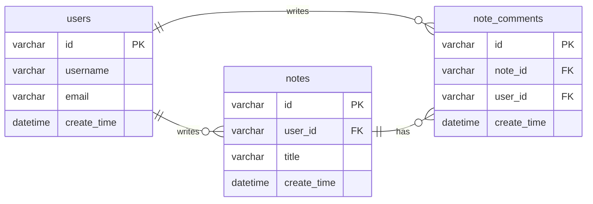

# Soul Oasis：基于 AI 的心理健康生态移动端应用 —— 期末项目报告

- **课程**：CS385FZ / CS385FZ[A] Mobile Application Development
- **项目名称**：Soul Oasis
- **小组**：Group 5
- **成员**：王赐宸（23125683）、傅思宇（23126825）、徐静雯（23126809）
- **日期**：2026-01
- **GitHub**：https://github.com/CICHENWANG/SoulOasisExpo

---

[TOC]

## Abstract（摘要）

Soul Oasis 是一个面向学生与高压人群的心理健康支持移动端应用，目标是提供**低门槛、强隐私、可持续**的情绪倾诉与自我调节工具。本项目按照课程要求实现了完整的**前后端分离**应用：前端采用 **React Native + Expo**，后端采用 **Spring Boot 2.7 + Sa-Token + MyBatis + MySQL**。应用包含用户注册/登录、社区笔记发布与浏览、以及 AI 对话等功能。

在 AI 对话模块中，我们通过后端 `/ai/chat` 实现对上游 OpenAI 兼容接口的代理调用，并在前端为用户提供连续对话体验；同时引入来自**手表端或移动端输入**的压力值（0-10）作为对话背景提示词的一部分，使回复更贴近用户当前状态。最终系统实现了从“登录-使用-发布内容-持续对话”的完整闭环，并满足课程对多页面、鉴权、数据持久化与 API 交互的核心要求。

---

## 1. Introduction（引言）

### 1.1 背景与动机
全球心理健康问题已成为重要社会议题。传统心理咨询虽然有效，但普遍存在：

- **可及性不足**：预约成本高、地域限制明显
- **隐私顾虑**：部分用户担心被贴标签（stigma），不愿线下求助
- **个性化不足**：通用内容难以匹配不同个体的压力来源与场景

移动端 AI 心理支持方案能够以更低成本提供即时帮助，并在隐私与可及性方面具有优势。

### 1.2 问题陈述
用户需要一个能够：

- 在压力上升时提供**即时倾诉出口**（“随时有人听”）
- 提供**可执行的调节建议**（而非空泛安慰）
- 支持**持续记录与趋势观察**（形成“疗愈闭环”）

的移动端应用。

### 1.3 目标用户
结合用户研究与画像，Soul Oasis 的目标人群包括：

- 专科生 / 大学生：焦虑、情绪波动、睡眠问题更突出
- 职场新人：高功能焦虑，压力在夜间集中爆发

### 1.4 项目目标与范围
本项目在课程周期内聚焦实现可落地的最小可用系统（MVP）：

- 完整的账号体系与鉴权
- 多页面导航与 UI 交互
- 与后端 API 的真实数据交互
- 社区笔记（发布、列表、详情、评论）
- AI 对话（支持多轮上下文 + 压力值提示词）

> 说明：项目愿景包含“手表端生理数据（HRV）驱动的主动提醒”等能力。在本次课程交付版本中，我们在移动端提供了**压力值输入/模拟**（例如首页滑块）来驱动 AI 对话提示词；在完整方案中该压力值可由手表端/健康数据采集模块提供。

---

## 2. Requirements Analysis（需求分析）

### 2.1 功能性需求（Functional Requirements）

- **账号与鉴权**
  - Passkey 免密码注册（FIDO2 / WebAuthn）
  - Passkey 免密码登录/退出登录（FIDO2 / WebAuthn），服务端签发会话 Token（Sa-Token）
  - 获取/更新用户信息
  - 找回密码（验证码生成与确认重置）

- **AI 对话助手**
  - 多轮对话
  - 将用户压力值（0-10）作为背景提示词输入
  - 后端代理调用 OpenAI 兼容模型接口（统一管理 Key，避免前端泄露）

- **社区（Community）**
  - 笔记列表（分页、搜索）
  - 发布笔记（表单提交）
  - 笔记详情
  - 评论列表与发表评论

- **疗愈/工具入口与基础导航**
  - Home / Healing / Community / Mine 四大 Tab
  - 多个功能页面（满足课程对 ≥4 个功能页面要求）

### 2.2 非功能性需求（Non-functional Requirements）

- **安全性**：登录后通过 token 进行鉴权；AI Key 不在前端明文存储
- **可靠性**：后端接口需进行参数校验与错误兜底；前端对网络异常给出提示
- **可用性**：UI 清晰、导航明确；关键按钮不被 TabBar 遮挡
- **可维护性**：前后端职责清晰；后端以 Controller/Service/Mapper 分层

### 2.3 用户故事（User Stories）

- 作为用户，我希望能注册并登录，以便保存我的信息与内容。
- 作为用户，当我压力很大时，我希望能随时与 AI 对话，得到共情与可执行建议。
- 作为用户，我希望能在社区发布笔记并浏览他人的内容，获得经验与支持。
- 作为用户，我希望能查看笔记详情并评论交流。

### 2.4 竞品分析（Competitive Analysis）

我们对常见心理健康/冥想/呼吸训练类产品进行了对比，聚焦以下维度：主动提醒、实时压力检测、内容个性化、疗愈闭环。

| 产品名称 | 主动提醒 | 实时压力检测 | 内容个性化 | 疗愈闭环 | 核心差异 |
| --- | --- | --- | --- | --- | --- |
| Calm | 无 | 无（缺少 HRV 数据支持） | 静态内容库 | 无追踪流程 | 完全静态化，缺乏动态适配 |
| Wysa | 无 | 仅通过聊天判断情绪 | 部分个性化 | 无效果追踪 | 无法感知真实生理压力状态 |
| MindEase | 无 | 无 | 基础模板 | 无追踪与规划 | 缺乏长期疗愈能力 |
| Breathwrk | 无 | 无 | 固定训练内容 | 无闭环 | 无法感知用户状态 |
| Soul Oasis（本项目） | 课程版本：无；完整方案：基于 HRV 预测主动提醒 | 课程版本：移动端压力值输入/模拟；完整方案：实时生理数据检测 | RAG/上下文驱动的个性化对话与建议 | 压力 → 干预 → 反馈 → 优化 | AI 驱动的动态疗愈全链路系统 |

本项目的差异化优势：

- **双重感知**：同时利用（可接入的）生理压力信号与对话语境，增强对用户状态的理解。
- **主动预警与及时干预**：从“被动倾诉”扩展到“可提醒、可干预”的体验。
- **闭环优化**：通过压力值/反馈驱动方案调整，支持长期趋势观察与持续改进。

---

## 3. System Design（系统设计）

### 3.1 总体架构

系统采用典型的前后端分离架构：

- **客户端（React Native + Expo）**
  - 负责 UI、导航、状态管理、调用后端 API
  - 使用 AsyncStorage 做轻量本地持久化（例如压力值、聊天会话）

- **服务端（Spring Boot 2.7）**
  - REST API
  - Sa-Token 鉴权
  - MyBatis + MySQL 数据持久化
  - AI 代理接口 `/ai/chat`（对上游 OpenAI 兼容接口做统一转发与返回解析）

### 3.2 应用结构（Screens & Navigation）

- **RootNavigator**：根据登录态切换到
  - `AuthStack`：Login / Register / ForgotPassword
  - `MainTabs`：HomeTab / HealingTab（ChatStack）/ CommunityTab / MineTab

- **ChatStack**：ChatHome / ChatHistory / Persona / VoiceChat
- **CommunityStack**：CommunityFeed / NoteDetail / PostNote

### 3.3 关键 UI/UX 设计要点

- 底部 TabBar 为自定义悬浮样式（absolute 布局）。因此社区页的发布按钮（FAB）需要根据 TabBar 高度与 safe area 动态偏移，避免遮挡。
- Chat 需要支持历史会话继续对话：通过路由参数传递 `sessionId` 和 `title`，并按会话 ID 从本地存储加载对话。

### 3.4 项目结构（代码仓库结构节选）

> 以下为核心目录结构（节选），便于快速理解前后端分层与主要模块位置。

```text
SoulOasisExpo/
├── CS385FZ_Final_Project_Report_Soul_Oasis.md
├── package.json
├── src/
│   ├── app/
│   │   ├── navigation/                # RootNavigator / MainTabs / 路由 types
│   │   └── providers/                 # AuthProvider / StressProvider 等
│   ├── features/
│   │   ├── auth/screens/              # Login / Register / ForgotPassword
│   │   ├── chat/screens/              # ChatHome / ChatHistory 等
│   │   ├── community/screens/         # Community / NoteDetail / PostNote
│   │   └── home/screens/              # Home / Visualization 等
│   ├── services/
│   │   ├── chat/chatApi.ts            # AI chat API client
│   │   ├── community/noteApi.ts       # Note/Comment API client
│   │   └── team_project_backend_1219/ # Spring Boot 后端服务
│   └── ui/                            # 通用 UI 组件与主题
└── assets/                            # 图片素材
```

### 3.5 页面展示


### 3.6 数据库设计（基于 MyBatis SQL 推断）

后端 `NoteMapper.xml` / `UserMapper.xml` 表明核心表包括：



### 3.7 前后端接口文档（API Specification）

#### 3.7.1 统一约定

- **Base URL**：`http://<server>:8080`
- **Content-Type**：`application/json`
- **鉴权**：登录后在请求头携带 `satoken: <token>`（Sa-Token）。
- **响应结构**：后端统一返回 `Result<T>`（`code/message/data`）。常见错误码：`200/400/401/500`。

#### 3.7.2 核心端点概览

| 模块 | Method | Path | 鉴权 | 说明 |
| --- | --- | --- | --- | --- |
| Auth（Passkey） | POST | `/auth/webauthn/register/options` | 否 | 注册：获取 challenge |
| Auth（Passkey） | POST | `/auth/webauthn/register/verify` | 否 | 注册：校验并签发 token |
| Auth（Passkey） | POST | `/auth/webauthn/login/options` | 否 | 登录：获取 challenge |
| Auth（Passkey） | POST | `/auth/webauthn/login/verify` | 否 | 登录：校验并签发 token |
| Community（Note） | GET | `/note/listNotes` | 是 | 列表：分页/搜索（`page/pageSize/keyword`） |
| Community（Note） | POST | `/note/postNoteText` | 是 | 发布笔记（表单提交） |
| Community（Note） | GET | `/note/getNoteDetail` | 是 | 详情（`noteId`） |
| Community（Note） | GET | `/note/listComments` | 是 | 评论列表（`noteId/page/pageSize`） |
| Community（Note） | POST | `/note/postComment` | 是 | 发表评论 |
| AI（Chat） | POST | `/ai/chat` | 可选 | 多轮对话（携带 `stressScore/mode/messages`） |
| User（Profile） | GET | `/user/getMyInfo` | 是 | 获取用户信息 |
| User（Profile） | POST | `/user/updateInfo` | 是 | 更新用户信息 |
| Auth（Legacy，可选） | POST | `/user/register` | 否 | 传统注册（回退路径） |
| Auth（Legacy，可选） | POST | `/user/doLogin` | 否 | 传统登录（回退路径） |
| Auth（Legacy，可选） | POST | `/user/logout` | 是 | 退出登录 |

#### 3.7.3 示例（AI 对话请求）

```json
{
  "stressScore": 7,
  "mode": "general",
  "messages": [
    { "role": "user", "content": "I feel anxious lately." }
  ]
}
```

---

## 4. Implementation（实现）

### 4.1 开发环境与工具

- **前端**：React Native (0.79.6) + Expo (^53)
- **导航**：React Navigation（native-stack + bottom-tabs）
- **本地存储**：@react-native-async-storage/async-storage
- **后端**：Spring Boot 2.7.17（Java 11）
- **鉴权**：Sa-Token 1.44.0
- **持久化**：MyBatis + MySQL 8
- **缓存/扩展**：Redis（spring-data-redis + jedis）

### 4.2 前端关键实现

- **压力值全局状态**
  - 使用 `StressProvider` 管理 `stress01`（0-1）与 `stressScore`（0-10），并通过 AsyncStorage 持久化。
  - Home 页面滑块更新压力值；Chat 页面读取压力值作为 AI 对话提示信息。

- **AI 对话调用链**
  - 前端 `chatApi.chat()` 调用后端 `/ai/chat`，按 `Result<T>` 解析。
  - 失败时给出错误提示并可降级（例如使用本地 mockReply）。

- **会话历史继续对话**
  - ChatHistory 通过路由参数将 `sessionId/title` 传入 ChatHome。
  - ChatHome 使用 `sessionId` 生成 AsyncStorage key，并加载/保存该会话消息列表。

- **Community 发布笔记 FAB 避免遮挡**
  - 使用 `useBottomTabBarHeight()` 获取 TabBar 高度，结合 safe area 计算 FAB 的 `bottom` 偏移。
  - 同步增加列表底部 `paddingBottom`，避免内容被 FAB/TabBar 覆盖。

#### 4.2.1 核心代码（节选）

（1）压力值全局状态（StressProvider）

```tsx
// src/app/providers/StressProvider.tsx
export function StressProvider({ children }: { children: React.ReactNode }) {
  const { user } = useAuth();
  const [stress01, setStress01State] = useState(0.08);

  const setStress01 = async (v: number) => {
    const next = Math.max(0, Math.min(1, v));
    setStress01State(next);
    await AsyncStorage.setItem(`stress:value:${user?.id ?? 'guest'}`, String(next));
  };

  const stressScore = useMemo(() => Math.round(stress01 * 10), [stress01]);
  return <StressContext.Provider value={{ stress01, stressScore, setStress01, isReady }}>{children}</StressContext.Provider>;
}
```

### 4.3 后端关键实现

- **Sa-Token 鉴权与放行策略**
  - 使用 `SaInterceptor` 对全局路径拦截并调用 `StpUtil.checkLogin()`。
  - 对登录、注册、重置密码、AI chat 等接口做白名单放行。

- **FIDO2 登录与 Token 签发（已实现）**
  - 通过 `/auth/webauthn/*` 完成注册与登录挑战（challenge）校验。
  - 校验通过后使用 `StpUtil.login(userId)` 为该用户签发 Sa-Token，并在后续业务请求中通过 header `satoken` 携带。

- **社区笔记与评论**
  - `NoteController` 提供笔记发布、列表、详情、评论等接口。
  - `NoteMapper.xml` 中实现分页/搜索、评论计数更新等 SQL。

- **AI 代理接口**
  - `POST /ai/chat` 接收 `stressScore/mode/messages`。
  - 组装 system prompt：要求中文、语气温和、输出“共情一句 + 1-3 条建议 + 追问”。
  - 调用上游 `baseUrl/chat/completions`（OpenAI 兼容），解析 `choices[0].message.content` 并返回。
  - Key/baseUrl/model 通过 `application.yml` 与环境变量配置（避免泄露）。

#### 4.3.1 核心代码（节选）

（1）AI 代理 Controller

```java
// src/services/team_project_backend_1219/.../Controller/AiController.java
@PostMapping("/chat")
public Result<String> chat(@RequestBody AiChatRequestDTO req) {
  String system = "你是 SoulOasis 的心理支持型 AI 助手..." + "\n用户当前压力值(0-10)：" + stressScore;
  // messages = [system] + last N messages
  // POST baseUrl + "/chat/completions"
  // parse choices[0].message.content
  return Result.success(200, "ok", reply);
}
```

---

## 5. Testing

### 5.1 测试策略

- **接口级测试**
  - 使用 Postman/curl 验证登录、笔记、评论、AI chat 接口返回结构与错误分支。

- **端到端人工测试**
  - 注册 → 登录 → 拉取社区列表 → 发布笔记 → 查看详情 → 评论 → Chat 对话 → 历史会话切换。

- **回归测试（Bug Fix Driven）**
  - 修复 token 无效导致的访问失败（鉴权白名单与开发 bypass 机制）。
  - 修复“继续对话未进入对应会话”的导航与存储逻辑。
  - 修复社区 FAB 被 TabBar 遮挡。

### 5.2 关键测试用例（示例）

- **Auth-01（FIDO Register）**：Passkey 注册完成后，服务端签发 `satoken`，后续业务接口可访问。
- **Auth-02（FIDO Login）**：Passkey 登录完成后可重新签发 `satoken`，并通过 header 访问受保护接口。
- **Note-01**：发布笔记成功，列表接口能返回该笔记，详情可读。
- **Note-02**：关键词搜索可过滤笔记。
- **Chat-01**：AI chat 返回非空回复；未配置 key 时返回明确错误。
- **UI-01**：Community FAB 在不同机型（有/无底部安全区）下不被 TabBar 遮挡。
- **UI-02**：ChatHistory 选择不同会话后继续聊，ChatHome 顶部标题与消息随会话变化。

### 5.3 结果

- 核心流程（注册-登录-交互-反馈）可完成。
- AI 对话具备多轮上下文输入与压力值背景提示。
- 社区功能具备完整 CRUD 中的“发布+列表+详情+评论”。

---

## 6. Evaluation（评估）

### 6.1 与课程核心要求对照

| 课程要求 | 实现情况 | 说明 |
| --- | --- | --- |
| Expo + React Native | ✅ | 前端 `souloasisexpo` 基于 Expo 53 |
| ≥4 个功能页面 | ✅ | Auth、Home、Healing/Chat、Community、Mine 等 |
| 注册/登录 | ✅ | `/user/register`、`/user/doLogin` |
| 前端调用后端并展示数据 | ✅ | 社区列表/详情、评论、AI chat |
| 至少一个除登录外的表单提交 | ✅ | 发布笔记、发表评论、找回密码 |
| 后端 ≥3 个 API | ✅ | 用户、笔记、AI chat 多个接口 |
| 数据持久化 | ✅ | MySQL（用户、笔记、评论）；本地 AsyncStorage（压力值、聊天会话） |

### 6.2 UI/UX 评估

- Tab 导航清晰，入口集中。
- Chat 与 Community 的关键交互可完成。
- 针对覆盖式 TabBar 的遮挡问题已做适配（FAB 动态偏移）。

### 6.3 局限与风险

- 课程交付版本中压力值可由手动输入/模拟提供；若接入手表端生理数据，需要额外的设备权限、数据同步与隐私合规工作。
- AI 质量受上游模型与提示词影响；需要更多安全策略与敏感内容处理。

---

## 7. Conclusion & Future Work（总结与展望）

### 7.1 项目总结

本项目完成了一个具有实际可运行价值的心理健康支持应用原型：

- 构建了完整的前后端体系与鉴权机制
- 提供了 AI 对话与社区笔记等核心功能
- 通过压力值提示词实现“更贴近当前状态”的对话体验

### 7.2 未来工作

- **数据层**：补充结构化的“压力事件/情绪记录”表，支持可视化趋势与报告生成。
- **AI 层**：引入更严格的安全策略（自伤/他伤识别与引导）、以及更精细的对话记忆管理。
- **多端扩展**：若条件允许，接入 Apple Watch/HealthKit 实现更接近最初设想的生理数据驱动。
- **社区增强**：匿名机制、内容审核、点赞收藏、推荐排序等。

---

## 8. Team Contribution（分工说明）

| 成员 | 主要负责模块 | 贡献说明 |
| --- | --- | --- |
| 王赐宸 |  |  |
| 傅思宇 |  |  |
| 徐静雯 |  |  |
