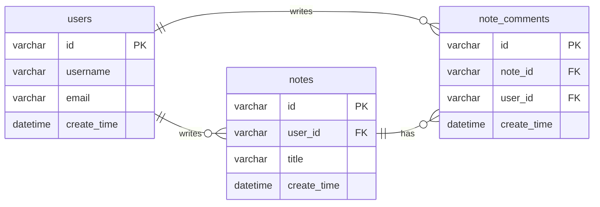

# Table of Contents

[TOC]

## Abstract

Soul Oasis is a mental health support mobile application designed for students and high-pressure groups. Its goal is to provide an **accessible**, **privacy-friendly**, and **sustainable** way for users to express emotions and practice self-regulation. Following the course requirements, we implemented a complete **front-end/back-end separated** application: the front end uses **React Native + Expo**, and the back end uses **Spring Boot 2.7 + Sa-Token + MyBatis + MySQL**. The app includes user registration/login, community note publishing and browsing, and AI-powered chat.

In the AI chat module, we proxy calls through the backend endpoint `/ai/chat` to an upstream OpenAI-compatible API, enabling a continuous conversational experience on the client. We also incorporate a stress score (0–10) entered from the **watch side or the mobile side** as part of the conversation context so that responses better match the user’s current state. Overall, the system achieves a complete loop of “login → use → publish content → ongoing conversation”, and meets the course’s core requirements for multi-screen navigation, authentication, data persistence, and API interaction.

---

## 1. Introduction

### 1.1 Background and Motivation

Mental health has become a major global concern. Although traditional counseling can be effective, it often has common limitations:

- **Limited accessibility**: high cost and strong geographic/availability constraints
- **Privacy concerns**: some users worry about stigma and hesitate to seek offline help
- **Limited personalization**: generic content does not match each person’s stressors and contexts

AI-based mobile mental health support can provide immediate help at lower cost, while offering advantages in privacy and accessibility.

### 1.2 Problem Statement

Users need a mobile app that can:

- Provide an **immediate outlet** when stress rises (“someone is always here to listen”)
- Offer **actionable regulation suggestions** (instead of vague comfort)
- Support **continuous recording and trend tracking** (forming a “healing loop”)

### 1.3 Target Users

Based on user research and personas, the target groups of Soul Oasis include:

- College/undergraduate students: more prominent anxiety, mood fluctuations, and sleep problems
- New professionals: high-functioning anxiety, with stress often peaking at night

### 1.4 Project Goals and Scope

Within the course timeline, we focused on delivering a practical Minimum Viable Product (MVP):

- A complete account system and authentication
- Multi-screen navigation and UI interactions
- Real data interaction with backend APIs
- Community notes (create, list, detail, comments)
- AI chat (multi-turn context + stress-score-guided prompting)

> Note: The long-term vision includes proactive reminders driven by watch-side physiological signals (e.g., HRV). In the course delivery version, we provide **stress score input/simulation** on mobile (e.g., a slider on the Home screen) to drive AI prompting. In a full solution, this stress score can be provided by a watch/health-data collection module.

---

## 2. Requirements Analysis

### 2.1 Functional Requirements

- **Account & Authentication**
  - Passkey passwordless registration (FIDO2 / WebAuthn)
  - Passkey passwordless login/logout (FIDO2 / WebAuthn), server issues session token (Sa-Token)
  - Fetch/update user profile
  - Password reset (verification code generation + confirmation)

- **AI Chat Assistant**
  - Multi-turn conversation
  - Use user stress score (0–10) as part of the prompt context
  - Backend proxies OpenAI-compatible model APIs (centralized key management to avoid exposing keys on the client)

- **Community**
  - Notes list (pagination, search)
  - Publish notes (form submission)
  - Note detail
  - Comments list and posting comments

- **Healing/Tools Entry & Basic Navigation**
  - Four main tabs: Home / Healing / Community / Mine
  - Multiple functional screens (meeting the requirement of ≥4 functional screens)

### 2.2 Non-functional Requirements

- **Security**: token-based authorization after login; AI keys are not stored in plaintext on the client
- **Reliability**: backend validates inputs and provides error handling; client shows network error prompts
- **Usability**: clear UI and navigation; key buttons should not be blocked by the TabBar
- **Maintainability**: clear separation of responsibilities; backend layered with Controller/Service/Mapper

### 2.3 Competitive Analysis

We compared common mental health/meditation/breathing apps using these dimensions: proactive reminders, real-time stress detection, personalization, and healing loop.

| Product | Proactive Reminder | Real-time Stress Detection | Personalization | Healing Loop | Key Difference |
| --- | --- | --- | --- | --- | --- |
| Calm | No | No (lacks HRV integration) | Static library | No tracking | Mostly static, limited adaptation |
| Wysa | No | Chat-based emotion inference only | Partial | No outcome tracking | Cannot sense real physiological stress |
| MindEase | No | No | Template-based | No tracking/planning | Limited long-term support |
| Breathwrk | No | No | Fixed training content | No loop | Not state-aware |
| Soul Oasis (this project) | Course version: No; Full vision: HRV-based proactive reminders | Course version: mobile input/simulation; Full vision: real-time physiological detection | RAG/context-driven personalized chat and suggestions | Stress → intervention → feedback → optimization | AI-driven dynamic healing pipeline |

Differentiators:

- **Dual sensing**: leverage (potential) physiological stress signals plus conversational context for better state understanding.
- **Timely intervention**: extend from “passive venting” to a reminder- and intervention-capable experience.
- **Closed-loop improvement**: adjust plans based on stress score/feedback, enabling long-term trend tracking.

---

## 3. System Design

### 3.1 Overall Architecture

The system follows a typical front-end/back-end separated architecture:

- **Client (React Native + Expo)**
  - UI, navigation, state management, backend API calls
  - Uses AsyncStorage for lightweight local persistence (e.g., stress value, chat sessions)

- **Server (Spring Boot 2.7)**
  - REST API
  - Sa-Token authentication
  - MyBatis + MySQL persistence
  - AI proxy endpoint `/ai/chat` (forward to an upstream OpenAI-compatible API and parse the response)

### 3.2 App Structure (Screens & Navigation)

- **RootNavigator**: switches based on auth state
  - `AuthStack`: Login / Register / ForgotPassword
  - `MainTabs`: HomeTab / HealingTab (ChatStack) / CommunityTab / MineTab

- **ChatStack**: ChatHome / ChatHistory / Persona / VoiceChat
- **CommunityStack**: CommunityFeed / NoteDetail / PostNote

### 3.3 Key UI/UX Notes

- The bottom TabBar is a custom floating style (absolute positioning). Therefore, the Community publishing FAB needs a dynamic bottom offset based on TabBar height and safe area insets to avoid overlap.
- Chat needs real session history: pass `sessionId` and `title` via route params and load messages from local storage by session ID.

### 3.4 Project Structure (Excerpt)

> The following excerpt highlights key directories for understanding modules and layering.

```text
SoulOasisExpo/
├── CS385FZ_Final_Project_Report_Soul_Oasis.md
├── package.json
├── src/
│   ├── app/
│   │   ├── navigation/                # RootNavigator / MainTabs / route types
│   │   └── providers/                 # AuthProvider / StressProvider etc.
│   ├── features/
│   │   ├── auth/screens/              # Login / Register / ForgotPassword
│   │   ├── chat/screens/              # ChatHome / ChatHistory etc.
│   │   ├── community/screens/         # Community / NoteDetail / PostNote
│   │   └── home/screens/              # Home / Visualization etc.
│   ├── services/
│   │   ├── chat/chatApi.ts            # AI chat API client
│   │   ├── community/noteApi.ts       # Note/Comment API client
│   │   └── team_project_backend_1219/ # Spring Boot backend service
│   └── ui/                            # Shared UI components and theme
└── assets/                            # Images
```

### 3.5 UI Design


### 3.6 Database Design (Inferred from MyBatis SQL)

The backend `NoteMapper.xml` / `UserMapper.xml` indicates core tables such as:



### 3.7 API Specification

#### 3.7.1 Conventions

- **Base URL**: `http://<server>:8080`
- **Content-Type**: `application/json`
- **Authentication**: after login, include `satoken: <token>` in request headers (Sa-Token)
- **Response format**: backend returns `Result<T>` (`code/message/data`). Common codes: `200/400/401/500`.

#### 3.7.2 Core Endpoints Overview

| Module | Method | Path | Auth | Notes |
| --- | --- | --- | --- | --- |
| Auth (Passkey) | POST | `/auth/webauthn/register/options` | No | Register: get challenge |
| Auth (Passkey) | POST | `/auth/webauthn/register/verify` | No | Register: verify + issue token |
| Auth (Passkey) | POST | `/auth/webauthn/login/options` | No | Login: get challenge |
| Auth (Passkey) | POST | `/auth/webauthn/login/verify` | No | Login: verify + issue token |
| Community (Note) | GET | `/note/listNotes` | Yes | List: pagination/search (`page/pageSize/keyword`) |
| Community (Note) | POST | `/note/postNoteText` | Yes | Create note (form submit) |
| Community (Note) | GET | `/note/getNoteDetail` | Yes | Detail (`noteId`) |
| Community (Note) | GET | `/note/listComments` | Yes | Comments (`noteId/page/pageSize`) |
| Community (Note) | POST | `/note/postComment` | Yes | Post comment |
| AI (Chat) | POST | `/ai/chat` | Optional | Multi-turn chat (`stressScore/mode/messages`) |
| User (Profile) | GET | `/user/getMyInfo` | Yes | Get profile |
| User (Profile) | POST | `/user/updateInfo` | Yes | Update profile |
| Auth (Legacy, optional) | POST | `/user/register` | No | Classic register (fallback) |
| Auth (Legacy, optional) | POST | `/user/doLogin` | No | Classic login (fallback) |
| Auth (Legacy, optional) | POST | `/user/logout` | Yes | Logout |

---

## 4. Implementation

### 4.1 Development Environment and Tools

- **Front end**: React Native (0.79.6) + Expo (^53)
- **Navigation**: React Navigation (native-stack + bottom-tabs)
- **Local storage**: @react-native-async-storage/async-storage
- **Back end**: Spring Boot 2.7.17 (Java 11)
- **Auth**: Sa-Token 1.44.0
- **Persistence**: MyBatis + MySQL 8
- **Cache/extension**: Redis (spring-data-redis + jedis)

### 4.2 Key Front-end Implementations

- **Global stress state**
  - Use `StressProvider` to manage `stress01` (0–1) and `stressScore` (0–10), persisted via AsyncStorage.
  - Home screen slider updates the stress value; Chat reads it as context for AI prompting.

- **AI chat call flow**
  - Front end calls backend `/ai/chat` via `chatApi.chat()` and parses `Result<T>`.
  - On failure, show an error and optionally degrade (e.g., local `mockReply`).

- **Continue conversation via session history**
  - ChatHistory passes `sessionId/title` to ChatHome via route params.
  - ChatHome loads/saves messages using an AsyncStorage key derived from `sessionId`.

- **Community publishing FAB (avoid TabBar overlap)**
  - Use `useBottomTabBarHeight()` and safe area insets to compute FAB `bottom` offset.
  - Increase the list `paddingBottom` so content is not covered by the FAB/TabBar.

### 4.3 Key Back-end Implementations

- **Sa-Token auth and allowlist strategy**
  - Use `SaInterceptor` to intercept routes and call `StpUtil.checkLogin()`.
  - Allowlist login/registration, password reset, and AI chat routes as needed.

- **FIDO2 and token issuance (implemented)**
  - Use `/auth/webauthn/*` to complete WebAuthn challenge verification for registration/login.
  - On success, issue a Sa-Token via `StpUtil.login(userId)` and accept it via the `satoken` header.

- **Community notes and comments**
  - `NoteController` provides endpoints for posting notes, listing, detail, and comments.
  - `NoteMapper.xml` implements pagination/search and comment count updates.

- **AI proxy endpoint**
  - `POST /ai/chat` accepts `stressScore/mode/messages`.
  - Build a system prompt and call upstream `baseUrl/chat/completions` (OpenAI-compatible), parse `choices[0].message.content`.
  - Configure key/baseUrl/model via `application.yml` and environment variables.

#### 4.3.1 Core Code Snippet（AI proxy controller）

```java
// src/services/team_project_backend_1219/.../Controller/AiController.java
@PostMapping("/chat")
public Result<String> chat(@RequestBody AiChatRequestDTO req) {
  String system = "你是 SoulOasis 的心理支持型 AI 助手..." + "\n用户当前压力值(0-10)：" + stressScore;
  // messages = [system] + last N messages
  // POST baseUrl + "/chat/completions"
  // parse choices[0].message.content
  return Result.success(200, "ok", reply);
}
```

---

## 5. Testing

### 5.1 Testing Strategy

- **API-level testing**
  - Use Postman/curl to verify auth, notes, comments, and AI chat responses and error paths.

- **End-to-end manual testing**
  - Register → Login → Load community list → Publish note → View detail → Comment → Chat → Switch session history.

- **Regression testing (bug-fix driven)**
  - Fix access failures caused by invalid tokens (allowlist and dev bypass strategy).
  - Fix “continue chat not loading correct session” (navigation + storage).
  - Fix Community FAB being covered by the TabBar.

### 5.2 Key Test Cases (Examples)

- **Auth-01 (FIDO Register)**: after Passkey registration, server issues `satoken`; protected APIs are accessible.
- **Auth-02 (FIDO Login)**: after Passkey login, server re-issues `satoken`; protected APIs are accessible.
- **Note-01**: publishing a note succeeds; list returns it; detail is readable.
- **Note-02**: keyword search filters notes.
- **Chat-01**: AI chat returns a non-empty reply; missing key yields a clear error.
- **UI-01**: Community FAB is not covered by the TabBar on devices with/without bottom safe area.
- **UI-02**: selecting a session in ChatHistory loads the correct title/messages in ChatHome.

---

## 6. Evaluation

### 6.1 Mapping to Core Course Requirements

| Requirement | Status | Notes |
| --- | --- | --- |
| Expo + React Native | ✅ | Front end is based on Expo 53 |
| ≥4 functional screens | ✅ | Auth, Home, Healing/Chat, Community, Mine, etc. |
| Registration/Login | ✅ | `/user/register`, `/user/doLogin` (fallback) and Passkey flow |
| Front end fetches and displays backend data | ✅ | Community list/detail, comments, AI chat |
| At least one non-auth form submission | ✅ | Publish note, post comment, password reset |
| Back end ≥3 APIs | ✅ | Multiple endpoints across user/note/AI |
| Data persistence | ✅ | MySQL (users, notes, comments); AsyncStorage (stress value, chat sessions) |

### 6.2 UI/UX Evaluation

- Clear tab navigation and consolidated entry points.
- Key interactions in Chat and Community work.
- Overlap risks from custom TabBar are handled via dynamic FAB offset.

### 6.3 Limitations and Risks

- In the course delivery version, stress score comes from manual input/simulation; watch-side physiological data requires additional permissions, syncing, and privacy compliance.
- AI quality depends on the upstream model and prompting; more safety strategies and sensitive-content handling are needed.

---

## 7. Summary

This project delivers a runnable prototype of a mental health support application:

- A complete front-end/back-end system with authentication
- Core features: AI chat and community notes
- Stress-score-guided prompting for responses that better match the user’s state

---

## 8. Team Contribution

| Member | Main Responsibility |
| --- | --- |
| Cichen Wang | Front-end & back-end development; integration; testing and debugging |
| Siyu Fu | UI illustration and product design; video editing |
| Jingwen Xu | UI illustration and product design; video editing |
