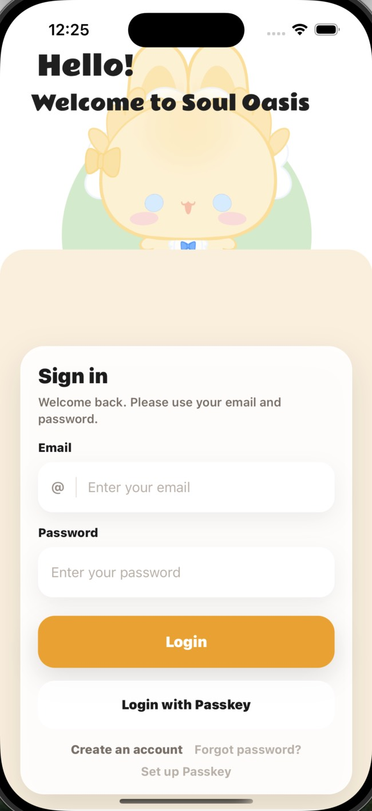
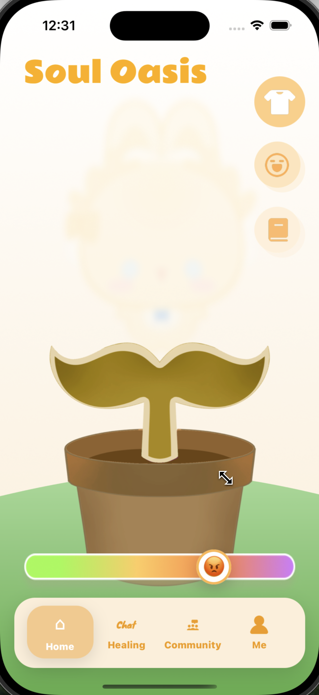
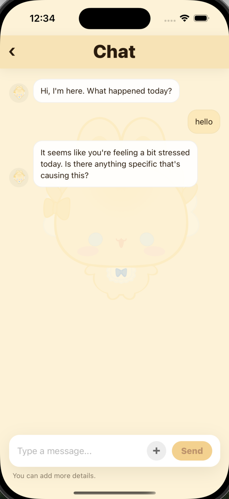
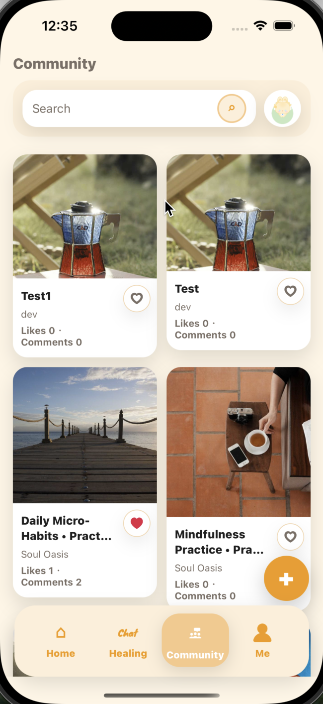
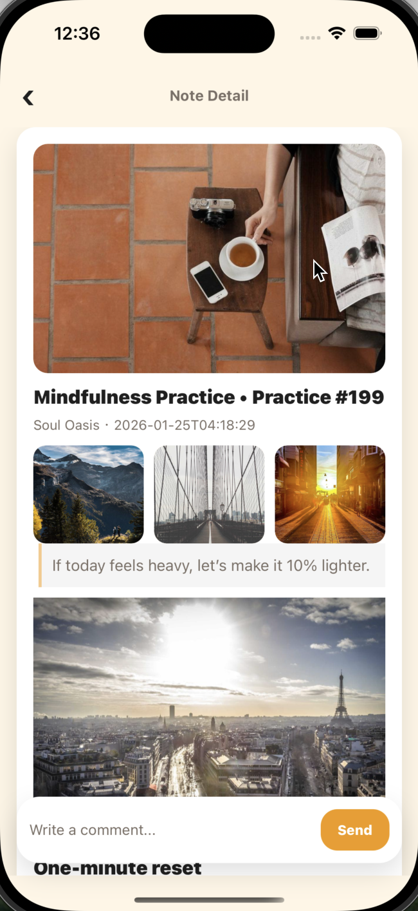

# Soul Oasis


Soul Oasis: An AI-powered mental health ecosystem mobile app.

Soul Oasis：一款面向学生与高压人群的 AI 心理健康支持应用，提供低门槛的情绪倾诉与自我调节工具。

## Features / 功能特性

- 🤖 **AI 对话**：支持多轮对话，并结合压力值（0-10）作为对话背景提示。
- 📝 **社区笔记**：笔记发布、列表浏览、详情查看与评论互动。
- 🔐 **账号与鉴权**：注册/登录后通过 token 访问受保护接口。

## Supported Platforms / 支持的平台

- **iOS**：支持 iOS 模拟器 / 真机（推荐在 iOS Simulator 上运行）。

## Quick Start / 快速开始

### Prerequisites / 前置要求

- Node.js（建议 v18+）
- npm
- Expo（会在首次运行时自动引导安装所需组件）
- iOS 开发：Xcode（macOS）
- 后端运行：Java 11+、Maven、MySQL

（可选）后端默认使用 Redis（见 `application.yml`），本地联调建议准备 Redis 服务。

### Start Frontend / 启动前端（React Native + Expo）

在项目根目录执行：

```bash
npm install
npm run start
```

#### 使用 Expo Go（推荐）

1. 在手机上安装 Expo Go
2. 运行 `npm run start` 后扫描终端中的二维码

#### 使用模拟器/开发构建（可选）

如果你需要在模拟器上直接运行（需要本机安装 Xcode / Android Studio 环境）：

```bash
npm run ios
```

### Start Backend / 启动后端（Spring Boot）

后端代码位于：

- `src/services/team_project_backend_1219/`

后端默认端口为 `8080`，数据库与 AI 代理参数可通过环境变量配置（见下文“配置”）。

使用 Maven Wrapper 启动（推荐，避免本机 Maven 版本差异）：

```bash
cd src/services/team_project_backend_1219
./mvnw spring-boot:run
```

启动后服务地址：`http://127.0.0.1:8080`

## Configuration / 配置

### 前端配置（`.env`，可选）

- **API 基础地址**：`EXPO_PUBLIC_API_BASE_URL`（默认 `http://127.0.0.1:8080`）
- **鉴权模式**：`EXPO_PUBLIC_AUTH_MODE`（`auto`/`backend`/`mock`）
- **开发绕过登录**：`EXPO_PUBLIC_AUTH_BYPASS=true`（仅用于开发/演示）

示例：

```env
EXPO_PUBLIC_AUTH_MODE=backend
EXPO_PUBLIC_API_BASE_URL=http://127.0.0.1:8080
EXPO_PUBLIC_AUTH_BYPASS=true
```

注意：如果前端跑在真机（非模拟器），`127.0.0.1` 需要替换为你电脑的局域网 IP。

### 后端配置（关键环境变量）

- **MySQL**：`MYSQL_HOST` `MYSQL_PORT` `MYSQL_DB` `MYSQL_USER` `MYSQL_PASSWORD`
- **Redis**：`REDIS_HOST` `REDIS_PORT` `REDIS_PASSWORD`
- **AI 代理**：`SOUL_AI_API_KEY` `SOUL_AI_BASE_URL` `SOUL_AI_MODEL`
- **开发绕过鉴权（可选）**：`SOUL_AUTH_BYPASS=true`

后端默认数据库名为 `sosd_blogs`（可通过 `MYSQL_DB` 覆盖），请确保 MySQL 已启动并创建对应数据库。

## Project Structure / 项目结构（节选）

```text
SoulOasisExpo/
├── README.md
├── README_EN.md
├── src/
│   ├── app/                           # 路由与全局 Provider
│   ├── features/                      # 各业务模块页面
│   ├── services/                      # API 客户端与后端工程
│   │   └── team_project_backend_1219/ # Spring Boot 后端
│   └── ui/                            # UI 组件与主题
└── docs/screenshots/                  # README 截图
```

## 开发指南

- **主要页面/业务模块**：`src/features/`（Auth、Chat、Community 等）
- **API 基础地址解析**：`src/services/apiBaseUrl.ts`
- **AI 聊天调用**：前端 `src/services/chat/chatApi.ts`，后端 `POST /ai/chat`
- **鉴权模式切换**：通过 `.env` 中 `EXPO_PUBLIC_AUTH_MODE` / `EXPO_PUBLIC_AUTH_BYPASS` 控制

## 常见问题

- **前端请求不到后端**：确认后端已运行在 `http://127.0.0.1:8080`；真机调试时把 `EXPO_PUBLIC_API_BASE_URL` 改成电脑局域网 IP。
- **数据库连接失败**：确认 MySQL 已启动、数据库已创建（默认 `sosd_blogs`），并检查 `MYSQL_*` 环境变量。
- **AI 对话无响应/报错**：确认后端已配置 `SOUL_AI_API_KEY`（以及需要时的 `SOUL_AI_BASE_URL`/`SOUL_AI_MODEL`）。

## License / 许可证

本项目为课程项目用途；如需开源许可声明，请在仓库根目录添加 `LICENSE` 文件并在此处更新。

## Contributing / 贡献

欢迎通过 Issue 提交问题与改进建议。

## Screenshots / 应用程序的截图

### 登录 / 注册



### 首页 / 压力值输入



### AI 对话



### 社区（列表 / 发布 / 详情）




